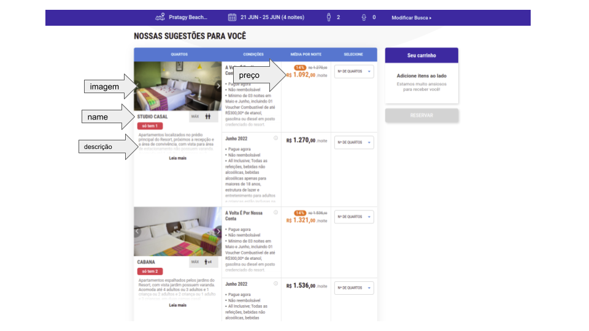

# Running the project

Create the container and install all dependencies with:

```
make up
```

Access the docker terminal:

```
make sh
```

Start the project in development:

```
yarn start:dev
```

To run the tests just execute:

```
yarn test
```

Expect Results:
Sucess (201 CREATED):

```
[
	{
		"name": "Studio Casal",
		"price": "R$  1.302,00",
		"description": "No prédio principal do Resort, sem varanda e próximo à recepção. Dispõe de uma cama de casal e uma cama de solteiro. Acomoda até 3 pessoas, sendo 2 Adultos e 1 Criança. Sem cama extra. Inclui ingressos do Pratagy Acqua Park*. All inclusive com serviço de buffet.",
		"image": "https://letsimage.s3.amazonaws.com/letsbook/193/quartos/30/fotoprincipal.jpg"
	},
	{
		"name": "Studio Familia",
		"price": "R$  1.433,00",
		"description": "No prédio principal do Resort, com varanda e vista para os jardins. Dispõe de uma cama de casal e uma cama de solteiro. Acomoda até 3 pessoas, nas opções de 1 adulto e 2 crianças (free até 12 anos) ou 2 adultos e 1 criança (free até 12 anos) ou 3 adultos. Sem cama extra. Inclui ingressos do Pratagy Acqua Park*. All inclusive com serviço de buffet.",
		"image": "https://letsimage.s3.amazonaws.com/letsbook/193/quartos/31/fotoprincipal.jpg"
	},
	{
		"name": "Cabana",
		"price": "R$  1.576,00",
		"description": "Nos jardins do Resort e com varanda. Dispõe de duas camas de casal. Acomoda até 4 pessoas, nas opções de 1 adulto + 3 crianças (free até 12 anos) ou 2 adultos e 2 crianças (free até 12 anos) ou 3 adultos e 1 criança (free até 12 anos) ou 4 adultos. Sem cama extra. Inclui ingressos do Pratagy Acqua Park*. All inclusive com serviço de buffet.",
		"image": "https://letsimage.s3.amazonaws.com/letsbook/193/quartos/32/fotoprincipal.jpg"
	},
	{
		"name": "Superior",
		"price": "R$  1.977,00",
		"description": "Próximo ao rio e no 2º piso. Dispõe de uma cama de casal, uma cama de solteiro e uma auxiliar. Acomoda até 4 pessoas: 1 adulto + 3 crianças (free até 12 anos) ou 2 adultos e 2 crianças (free até 12 anos) ou 3 adultos e 1 criança (free até 12 anos). Sem cama extra. Inclui ingressos do Pratagy Acqua Park*. All inclusive com serviço de buffet.",
		"image": "https://letsimage.s3.amazonaws.com/letsbook/193/quartos/34/fotoprincipal.jpg"
	},
	{
		"name": "Boutique Vista Mata",
		"price": "R$  1.977,00",
		"description": "All Inclusive Premium com serviço de mordomia e restaurante a la carte. Localizado na parte mais alta da Reserva Pratagy em ambiente com exclusividade. Acomoda até 3 adultos ou 2 adultos e 1 criança (free até 12 anos) ou 1 adulto e 2 crianças (free até 12 anos). Inclui ingressos do Pratagy Acqua Park para todos os dias.",
		"image": "https://letsimage.s3.amazonaws.com/letsbook/193/quartos/63/fotoprincipal.jpg"
	},
	{
		"name": "Superior Premium",
		"price": "R$  2.175,00",
		"description": "Com banheira na varanda e no 1º piso. Dispõe de uma cama de casal, uma cama de solteiro e uma auxiliar. Para até 4 pessoas: 1 adulto + 3 crianças (free até 12 anos) ou 2 adultos e 2 crianças (free até 12 anos) ou 3 adultos e 1 criança (free até 12 anos). Sem cama extra. Inclui ingressos do Pratagy Acqua Park*. All inclusive com serviço a la carte e acesso ao espaço Premium Class. ",
		"image": "https://letsimage.s3.amazonaws.com/letsbook/193/quartos/59/fotoprincipal.jpg"
	},
	{
		"name": "Boutique Refúgio",
		"price": "R$  2.214,00",
		"description": "All Inclusive Premium com serviço de mordomia e restaurante a la carte. Acomodação única com paredes de vidro e banheira, localizada ao redor da mata na parte mais alta da Reserva Pratagy. Acomoda até 02 adultos. Inclui ingressos do Pratagy Acqua Park para todos os dias.",
		"image": "https://letsimage.s3.amazonaws.com/letsbook/193/quartos/64/fotoprincipal.jpg"
	}
]
```

```
Timeout error (408 TIMEOUT):
```

{
"statusCode": 408,
"message": "Could not find the elements on the page"
}

```
# Test Dev Asksuite

Hey! Glad you're here.
I'm going to explain exactly what you'll have to implement in this test and what we expect as outcome.

First of all, we have this nice express.js boilerplate project to assist you so you don't have to create everything from scratch.

## Briefing
The traveller comes to our bot and asks for "Price quotation". Then the bot asks for the dates the traveller wants to
stay at the bot's hotel.
At the moment the traveller fills the requested information the bot needs to search the prices for each room available in the check-in/check-out
timeframe.

You will have to implement the API responsible for doing the searching part.
The necessary information for the crawler is under the [Assets](#assets) session

## What you'll need to do:
* Create a POST endpoint "/search"
    * The expected payload is:

        <pre>
        {
            "checkin": "YYYY-MM-DD", // Check-in date
            "checkout": "YYYY-MM-DD" // Check-out date
        }
        </pre>

       Example

        <pre>
        {
            "checkin": "2021-07-01",
            "checkout": "2021-07-03"
        }
        </pre>

    * The expected result is an array of rooms:

        <pre>
        [{
            "name": string, // Room name
            "description": string,  // Room description
            "price": string, // Room daily price
            "image": string, // Room main photo
        }]
        </pre>

        Example

        <pre>
        [{
            "name": "STUDIO CASAL",
            "description": "Apartamentos localizados no prédio principal do Resort, próximos a recepção e a área de convivência, com vista para área de estacionamento não possuem varanda. Acomoda até 1 adulto e 1 criança ou 2 adultos",
            "price": "R$ 1.092,00",
            "image": "https://letsimage.s3.amazonaws.com/letsbook/193/quartos/30/fotoprincipal.jpg"
        },
        {
            "name": "CABANA",
            "description": "Apartamentos espalhados pelos jardins do Resort, com vista jardim possuem varanda. Acomoda até 4 adultos ou 3 adultos e 1 criança ou 2 adultos e 2 criança ou 1 adulto e 3 crianças, em duas camas casal.",
            "price": "R$ 1.321,00",
            "image": "https://letsimage.s3.amazonaws.com/letsbook/193/quartos/32/fotoprincipal.jpg"
        }]
        </pre>

To achieve this result you may:

* With puppeteer, go to the [given URL](#assets)
* Retrieve the needed information to assemble the payload using web crawling methods

## Environment
* Node 10+
* Dotenv setup

Already installed: `express` `puppeteer` `dotenv`

**_Feel free to add any lib you find relevant to your test._**


## Running
* Install dependencies with: `npm install`
* Run as dev: `npm run dev`

Default port is set to `8080`

## Assets
* Crawl URL sample (change dates):
<pre>https://pratagy.letsbook.com.br/D/Reserva?checkin=21%2F06%2F2022&checkout=25%2F06%2F2022&cidade=&hotel=12&adultos=2&criancas=&destino=Pratagy+Beach+Resort+All+Inclusive&promocode=&tarifa=&mesCalendario=6%2F14%2F2022</pre>
* Help images:


## Test rating
What do we evaluate with this test?

* Dev's capacity of:
    * Self-learning
    * Working with node
    * Understanding an existent project
* Dev's code quality:
    * Clear and maintainable code
    * Coding structure
    * Changes that don't break easily

```
